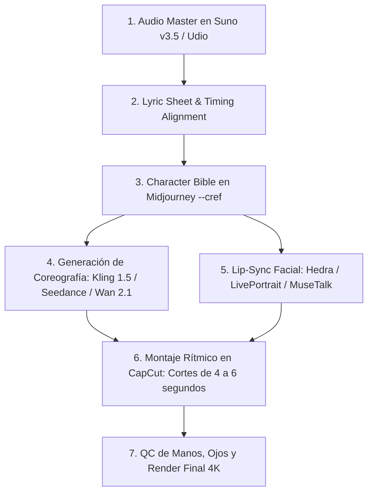

# 🔬 Investigación Maestra: Avatares Virtuales (K-Pop/MV), Canales de Fe, Finanzas Cristianas y Neurociencia
### *Auditoría de tendencias en X (Twitter), Arquitectura Multi-Agente y Protocolo Operativo 2026 · Autor: @ponchogf88*

---

## 1. ¿Qué se está debatiendo en X? El Ecosistema de Avatares Musicales (K-Pop AI)

En la comunidad global de IA en X (Twitter), creadores y directores técnicos han superado la etapa rudimentaria del "talking head" estático. El estándar actual para producir videos musicales completos con avatares hiperrealistas estilo K-Pop se fundamenta en un **pipeline desacoplado por capas**:

### ⚠️ El Error Común con HeyGen y Avatares Comerciales
Intentar generar un video musical completo de 3 minutos subiendo la canción directamente a HeyGen produce un resultado rígido y aburrido que la audiencia descarta en los primeros 10 segundos, además de consumir créditos innecesariamente. 
- **La solución técnica validada en X:** Un video musical de 3 minutos requiere entre **22 y 28 tomas distintas**. HeyGen o LivePortrait se reservan exclusivamente para **primeros planos cantando el coro (cortes de 4 a 6s)**, mientras que los planos generales y medios de baile provienen de Kling AI o Seedance.

---

## 2. Ingeniería Inversa de "Galeano con Dios": Fe, Finanzas y Neurociencia

El éxito de canales de oración con millones de vistas se basa en tres pilares invisibles para el público general:

### A) El Arquetipo de la Voz ("Padre + Hermano Mayor")
- **Psicología:** No es la voz de un pastor gritando desde el púlpito ni la de un conferencista motivacional. Es una voz serena, que transmite protección, cercanía y descanso.
- **Configuración en ElevenLabs:**
  - Modelo: `Eleven Multilingual v2`
  - Voice Stability: `0.65` (sólida y creíble)
  - Clarity + Similarity: `0.78`
  - Style Exaggeration: `0.15` (evita inflexiones teatrales)
  - Pausas: 1.5 segundos entre bloques para permitir al oyente respirar y asimilar.

### B) El Eje de Oro: Oración + Educación Financiera Bíblica
La audiencia mayoritariamente consume contenido de oración a las 05:00 - 07:00 AM y a las 21:00 - 00:00 hrs debido a la **ansiedad financiera y la incertidumbre laboral**. 
- La Biblia contiene más de 2,350 versículos sobre administración, deudas y prudencia económica.
- Al unir la paz de la oración matutina con herramientas prácticas de administración (Método Bola de Nieve Bíblico, Fondo de Emergencia de Proverbios, la regla 70/20/10), el canal deja de ser un devocional más y se convierte en una **guía indispensable de vida**.

### C) El Fundamento Neurocientífico (Dr. Andrew Huberman & Neuroteología)
- La oración contemplativa sostenida (>12 minutos) disminuye la reactividad de la **amígdala cerebral** (centro del miedo y el pánico por deudas).
- Aumenta las oscilaciones en bandas **Alfa (8-12 Hz)** y **Theta (4-7 Hz)**, induciendo un estado de calma alerta.
- Activa la **corteza prefrontal dorsolateral**, desbloqueando la capacidad de tomar decisiones racionales de ahorro e inversión en lugar de compras impulsivas por estrés.

### D) La Ventaja Fronteriza Bilingüe (Texas / México)
- **Español:** Conecta la emoción profunda, la nostalgia del hogar y la fe ancestral.
- **Inglés:** Estructura los conceptos de administración patrimonial, inversión y finanzas personales ("Biblical Wealth Stewardship").
- Esto permite un posicionamiento dual en el algoritmo de YouTube, capturando el CPM elevado de Estados Unidos ($8 a $15 USD por 1,000 vistas).

---

## 3. Repositorios Open Source y Automatización n8n

Para eliminar errores humanos y evitar alucinaciones, el pipeline se estandariza con herramientas open source probadas:

1. **tube-assistant (metiu1):** Script en Python con LLM, Edge TTS gratuito, Pexels API y compilación en FFmpeg con subida a YouTube Data API v3.
2. **quran-reels-maker:** Generación masiva de contenido sacro en bucle con versículos y fondos cinemáticos.
3. **avatar-mix (Upload-Post):** Integración de avatar con fondos en movimiento y subtítulos dinámicos.
4. **vanta / LivePortrait:** Inferencia local de Lip-Sync y expresiones faciales a partir de 1 foto y 1 pista de audio sin costo de API.

### 📜 El Contrato JSON Inquebrantable
El modelo de lenguaje nunca improvisa si su salida está restringida a un esquema JSON validado:
- `titulo`: Máximo 70 caracteres con gancho emocional.
- `duracion_objetivo`: 15:00 a 20:00 minutos.
- `bloques`: `intro` (45s), `oracion` (8 min), `reflexion_financiera` (4 min), `cierre` (2 min).
- `nota_voz`: Especificación emocional estricta para la síntesis.
- `visual`: Prompt para generación de imagen o stock footage.

---

## 4. Estado de los 7 Guiones Maestros (Fase 2)

Los 7 guiones iniciales han sido codificados en formato JSON estricto en el archivo:
📁 `SPIRITUALLY/ASSETS_STREAMING_24_7/PIPELINE_7_GUIONES_FE_Y_FINANZAS.json`

| Día | Tema | Título | Versículo |
| :---: | :--- | :--- | :---: |
| **1** | Ansiedad por Dinero | Oración de la mañana para soltar la ansiedad por el dinero | Filipenses 4:6-7 |
| **2** | Romper Deudas | Rompe el ciclo de las deudas: Principio bíblico de libertad | Proverbios 22:7 |
| **3** | Dador Alegre | Dios bendice al dador alegre: La ciencia y la fe del dar | 2 Corintios 9:7 |
| **4** | Trabajo y Negocio | Oración por tu trabajo, negocio y sabiduría para emprender | Deuteronomio 8:18 |
| **5** | Fondo de Paz | Construyendo tu Fondo de Paz: El ahorro como testimonio | Proverbios 6:6-8 |
| **6** | Contentamiento | Vence la envidia y la comparación: El contentamiento | 1 Timoteo 6:6 |
| **7** | Consagración | Resumen semanal: Oración de consagración de tus finanzas | Salmo 37:5 |

---

## 5. Ubicación de los Entregables y Respaldos

- **PDF Maestro en Escritorio:** `Informe_Maestro_Avatares_Kpop_y_Canales_Fe_Finanzas.pdf`
- **JSON Canónico de Guiones:** `PIPELINE_7_GUIONES_FE_Y_FINANZAS.json`
- **Sincronización:** Replicado en iCloud Drive, Google Drive, Notion Santuario, Obsidian Vault y GitHub (@ponchogf88).
